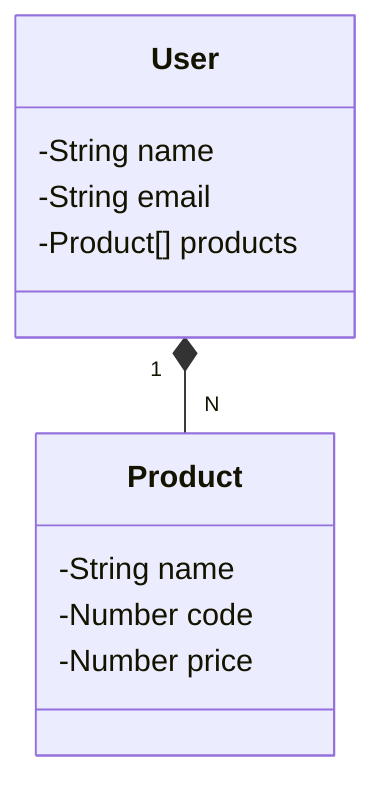

# First-API
## Class Diagram

```mermaid
classDiagram
  class User {
    -String name
    -String email
    -Product[] products
  }

  class Product {
    -String name
    -Number code
    -Number price
  }

  User "1" *-- "N" Product
```
